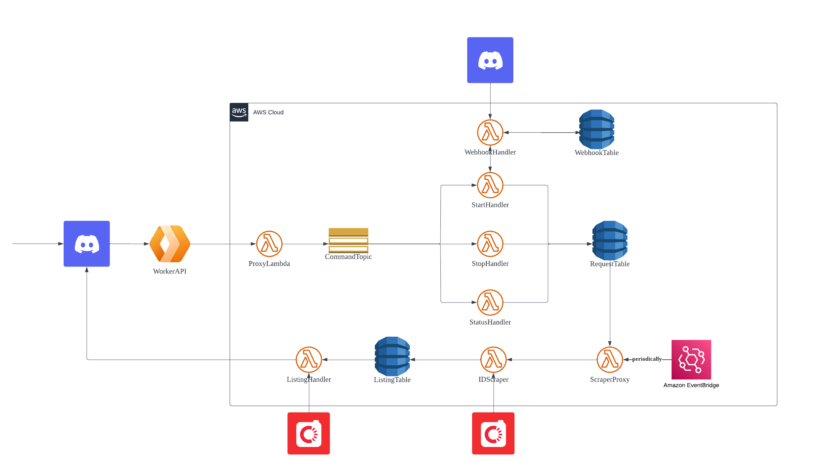

# Carousell Discord Scraper

## Introduction

This is a scraper that queries carousell.sg periodically and sends new listings to Discord.

## Commands

#### /start [url?]

Starts the scraper at the target url in the current channel. If scraper is already running in the channel, change the target url.

#### /stop

Stops the scraper in the current channel.

#### /status

Queries if the scraper is running in the current channel.

## Requirements

- Node.js
- yarn
- serverless

## Setup

#### Installation and environment variables

In the root folder, run

```bash
yarn install
yarn yarn-recursive
```

From the Discord Developer Portal, get the application ID and bot token.
Refer to the `.env.example` files to create and place `.env.${stage}` files in the `aws` and `register_commands` directory. .

#### Register commands

```bash
yarn register-commands-${stage}
```

#### Deploy bot endpoint

```bash
yarn deploy-${stage}
```

#### Link endpoint to the bot

Find the CloudFlare worker named `carouselldiscordscraperapi-${stage}` and copy its route. It should look like this `https://carouselldiscordscraperapi-${stage}.${user}.workers.dev/`

Paste the route into the Discord Developer Portal at Interactions Endpoint URL

## Architecture and Data Flow



### On request

1. A CloudFlare worker[^1] receives each request, defers the response and redirects the request to `ProxyLambda`
2. `ProxyLambda` publishes the request into the SNS Topic `CommandTopic`
3. `CommandTopic` distributes the requests to the individual command handlers.

[^1]: CloudFlare, with its zero cold start times, is reluctantly used to meet the 3s response time limit set by Discord.

Start:

1. `StartHandler` requests a Discord webhook url from `WebhookHandler`.
2. `WebhookHandler` checks the `WebhookTable` for an existing webhook in the same channel, and creates one using the Discord HTTP API if none exist. (Note that a webhook is created for EACH channel and is not deleted automatically)
3. `StartHandler` creates an item in `RequestTable`

Stop:

1. `StopHandler` removes an item in `RequestTable`

Status:

1. `StatusHandler` checks if an item exists with the given channel ID in `RequestTable`.

### Every x minutes:

1. Amazon EventBridge invokes `ScraperProxy`
2. `ScraperProxy` scans all requests from `RequestTable` and invokes `IDScraper`
3. `IDScraper` makes a GET request to the target URL and puts all listing IDs into `ListingTable`
4. `ListingHandler` gets the INSERT event from `ListingTable`'s stream and gets listing details from https://www.carousell.sg/ds/listing-detail/3.1/listings/${listing_id}/detail/?country_code=SG
5. `ListingHandler` posts the new listing to Discord using the webhook

## DynamoDB Tables

### RequestTable

Stores all current scraping requests.

Fields:

- channel_id (S) - Partition key
- target_url (S)
- webhook_url (S)

### WebhookTable

Stores all created webhooks.

Fields:

- channel_id (S) - Partition key
- webhook_url (S)

### ListingTable

Stores all reported listings.

Fields:

- channel_id (S) - Partition key
- listing_id (S) - Sort key
- ttl (S)
- webhook_url (S)
